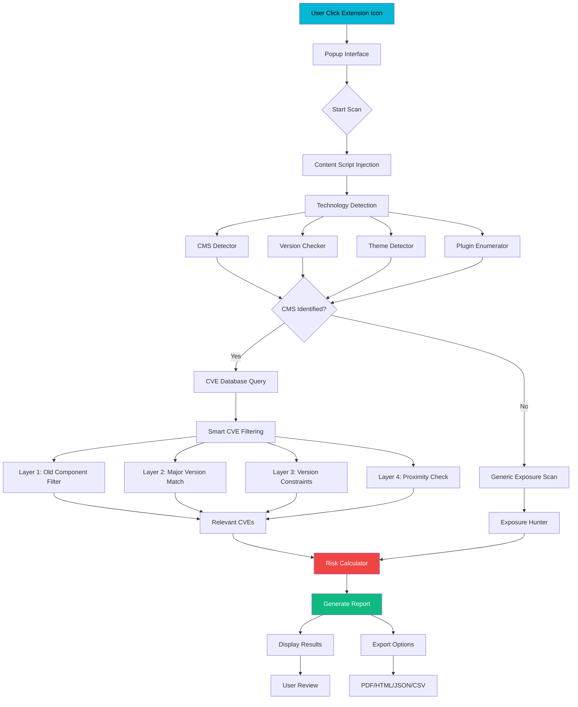
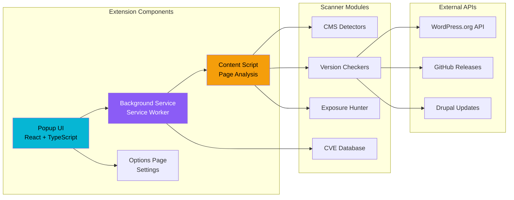
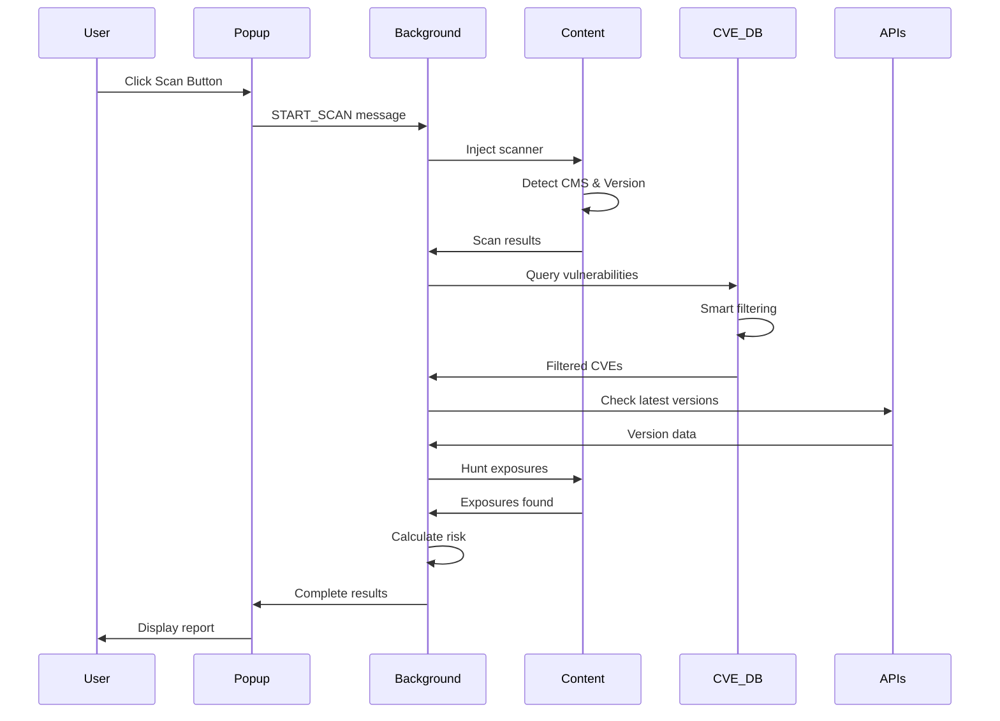
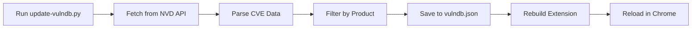

# 🔒 MASTA GHIMAU SPECTER- Attack Surface Intelligence

[](https://github.com/yourusername/masta-specter)
[](LICENSE)
[](https://chrome.google.com/webstore)

> **Enterprise-grade security analyzer with CVE mapping for web applications**


## 🎯 Overview

**masta ghimau SPECTER** is a powerful Chrome extension designed for security professionals, penetration testers, and web developers to analyze attack surfaces of websites. It detects Content Management Systems (CMS), identifies vulnerabilities through CVE mapping, and discovers security exposures.

### Supported Platforms

| Platform   | Version Detection | CVE Mapping | Exposure Scanning |
| ---------- | ----------------- | ----------- | ----------------- |
| WordPress  | ✅                | ✅          | ✅                |
| Joomla     | ✅                | ✅          | ✅                |
| Drupal     | ✅                | ✅          | ✅                |
| Magento    | ✅                | ✅          | ✅                |
| Custom PHP | ⚠️ Limited        | ⚠️ Limited  | ✅                |

---

## ✨ Features

### 🔍 Technology Detection

- **CMS Identification**: WordPress, Joomla, Drupal, Magento
- **Version Detection**: Accurate version fingerprinting
- **Theme Detection**: Active theme identification
- **Plugin Enumeration**: Detect installed plugins/modules
- **Server Detection**: Apache, Nginx, PHP version detection

### 🛡️ Vulnerability Analysis

- **CVE Mapping**: Smart CVE filtering based on detected versions
- **4-Layer Filtering**: Prevents false positives
- **Severity Classification**: Critical, High, Medium, Low
- **Remediation Guidance**: Step-by-step fix instructions

### 🚨 Exposure Discovery

- **Backup Files**: Scan for exposed backups (.zip, .sql, .tar.gz)
- **Sensitive Files**: Detect .env, .git/config, config files
- **Admin Panels**: Find login pages and admin interfaces
- **Directory Listing**: Identify open directories

### 📊 Reporting

- **Risk Scoring**: A-F grade based on findings
- **Multiple Formats**: PDF, HTML, JSON, CSV export
- **Visual Dashboard**: Interactive risk visualization
- **Historical Data**: Track changes over time

---

## 🏗️ Architecture

### System Flow



### Component Architecture



### Data Flow




## 📦 Installation


### Loading Release File in Chrome

#### Method 1: Load Unpacked (Development)

1. **Extract** the ZIP file to a folder (e.g., `masta-specter-v1.0.0/`)
2. Open Chrome and go to `chrome://extensions/`
3. Enable **"Developer mode"** (toggle top-right)
4. Click **"Load unpacked"**
5. Select the extracted folder
6. Extension appears in toolbar

#### Method 2: Drag and Drop (Quick Test)

1. Open Chrome and go to `chrome://extensions/`
2. Enable **"Developer mode"**
3. **Drag and drop** the extracted ZIP file onto the extensions page
4. Chrome will automatically extract and load it


## � Usage

### Quick Start

1. **Navigate** to any website you want to analyze
2. **Click** the masta ghimau SPECTER icon in your browser toolbar
3. **Click** "Start Security Scan"
4. **Review** the results in the popup interface

### Understanding Results

| Grade | Risk Level    | Description                      |
| ----- | ------------- | -------------------------------- |
| **A** | 🟢 Low        | Minimal security issues found    |
| **B** | 🟡 Medium-Low | Minor exposures detected         |
| **C** | 🟠 Medium     | Moderate vulnerabilities present |
| **D** | 🔴 High       | Significant security risks       |
| **F** | ⚫ Critical   | Immediate attention required     |

### Tabs Overview

| Tab                 | Content                                       |
| ------------------- | --------------------------------------------- |
| **Overview**        | Risk grade, summary statistics, quick actions |
| **Vulnerabilities** | CVE list with severity and remediation        |
| **Exposures**       | Discovered sensitive files and paths          |
| **Assets**          | Detected technologies and versions            |

---

## 🔄 CVE Database Update

### Using Python Script

The extension includes a Python script to update the CVE database from NVD (National Vulnerability Database).

```bash
# Navigate to scripts directory
cd scripts

# Install required packages
pip install requests python-dotenv

# Run the update script
python update-vulndb.py
```

### Script Options

| Option      | Description                  | Example                                       |
| ----------- | ---------------------------- | --------------------------------------------- |
| `--full`    | Full database update         | `python update-vulndb.py --full`              |
| `--product` | Update specific product only | `python update-vulndb.py --product wordpress` |
| `--since`   | Update since specific date   | `python update-vulndb.py --since 2024-01-01`  |

### Manual Update Process



### API Key Configuration (Optional)

Create a `.env` file in the scripts directory:

```env
NVD_API_KEY=your_api_key_here
```

> **Note**: API key increases rate limits from 10 to 50 requests per 30 seconds

---

## 🧪 Testing

### Test Matrix

| Test Case           | Method                | Expected Result                  |
| ------------------- | --------------------- | -------------------------------- |
| WordPress Detection | Visit wordpress.org   | Detects "WordPress" with version |
| Joomla Detection    | Visit joomla.org      | Detects "Joomla" with version    |
| CVE Filtering       | Scan Joomla 5.x       | No old component CVEs shown      |
| Exposure Scan       | Visit test site       | Finds backup files if present    |
| Report Export       | Click PDF button      | Downloads PDF report             |
| Options Page        | Right-click → Options | Opens settings page              |

### Manual Testing Checklist

```markdown
- [ ] Extension icon appears in toolbar
- [ ] Popup opens on click
- [ ] Scan starts successfully
- [ ] CMS detection works
- [ ] Version detection accurate
- [ ] CVEs relevant to version
- [ ] No false positives in CVEs
- [ ] Exposures discovered correctly
- [ ] Risk grade calculated
- [ ] PDF export works
- [ ] HTML export works
- [ ] JSON export works
- [ ] Options page loads
- [ ] Settings save correctly
```


## 📸 Screenshots

### Extension Interface

  

#### Main Popup

  


_The main popup interface showing the Masta Specter extension with its sleek dark theme design._

  

#### Scanning in Progress

  


_Real-time scanning progress with animated indicators showing the security analysis in action._

  

### Scan Results

  

#### Overview Results

  


_Comprehensive scan results displaying detected CMS, risk grade, and summary statistics._

  

#### CVE Vulnerabilities

  


_Detailed CVE vulnerability listing with severity levels and smart filtering applied._

  

#### Technology Stack Detection

  


_Detected technology stack showing CMS version, server information, and installed components._

  

#### Exposures Found

  


_Discovered security exposures including backup files, sensitive paths, and admin panels._

  

### Options & Settings

  

#### Options Page - General Settings

  


_Extension options page showing general settings and configuration options._

  

#### Options Page - Advanced Settings

  


_Advanced settings including API configurations and scan preferences._

  

### Reports & Export

  

#### Report Generation

  


_Report generation interface with multiple export format options (PDF, HTML, JSON, CSV)._

  

#### PDF Report - Summary

  


_Generated PDF report showing executive summary with risk assessment and key findings._

  

#### PDF Report - Vulnerabilities

  


_Detailed vulnerability section in PDF report with CVE listings and remediation steps._

  

#### PDF Report - Technical Details

  


_Technical details section showing detected technologies and version information._

  

#### PDF Report - Exposures

  


_Security exposures section documenting all discovered sensitive files and paths._

  

### Image Credits

  

_All screenshots captured from Masta Specter v1.0.0 by Hussein Mohamed (Masta Ghimau)_

  

---


## ⚠️ Disclaimer

> **IMPORTANT NOTICE**

**This tool may provide false positives and false negatives. Manual verification is always required.**

### Limitations

1. **CVE Coverage**: The embedded CVE database may not include all vulnerabilities
2. **Version Detection**: Some websites may hide or fake version information
3. **False Positives**: CVE filtering algorithms may occasionally show irrelevant vulnerabilities
4. **False Negatives**: Zero-day vulnerabilities and unreported issues won't be detected
5. **Network Issues**: Some exposure checks may fail due to network restrictions

### Responsible Use

- ✅ Use only on websites you own or have permission to test
- ✅ Verify all findings manually before taking action
- ✅ Combine with other security tools for comprehensive assessment
- ✅ Report false positives to help improve the tool

### Legal Notice

This tool is provided for educational and authorized security testing purposes only. The author is not responsible for any misuse or damage caused by this tool. Always ensure you have proper authorization before scanning any website.

---

## 👨‍💻 Author

**Hussein Mohamed (masta ghimau)**

- 🎥 **YouTube**: [youtube.com/@mastaghimau](https://www.youtube.com/@mastaghimau)
- 💻 **GitHub**: [github.com/yourusername](https://github.com/yourusername)
- 🐦 **Twitter**: [@mastaghimau](https://twitter.com/mastaghimau)

### About the Author

Hussein Mohamed, also known as masta ghimau, is a cybersecurity enthusiast and content creator focused on web application security, penetration testing, and vulnerability research. This extension was developed to help security professionals quickly assess website attack surfaces.

---

## 📄 License

This project is licensed under the MIT License - see the [LICENSE](LICENSE) file for details.

---

## 🙏 Acknowledgments

- **NVD (National Vulnerability Database)** - CVE data source
- **WordPress.org** - Version API
- **Joomla Project** - Security information
- **Drupal Security Team** - Vulnerability data

---

## 📞 Support

For support, questions, or feature requests:

1. Open an issue on GitHub
2. Contact via YouTube comments
3. Email: [your-email@example.com]

---

<p align="center">
  <strong>🔒 masta ghimau SPECTER - Know Your Attack Surface 🔒</strong>
</p>

<p align="center">
  Made with ❤️ by <a href="https://www.youtube.com/@mastaghimau">Hussein Mohamed (masta ghimau)</a>
</p>
